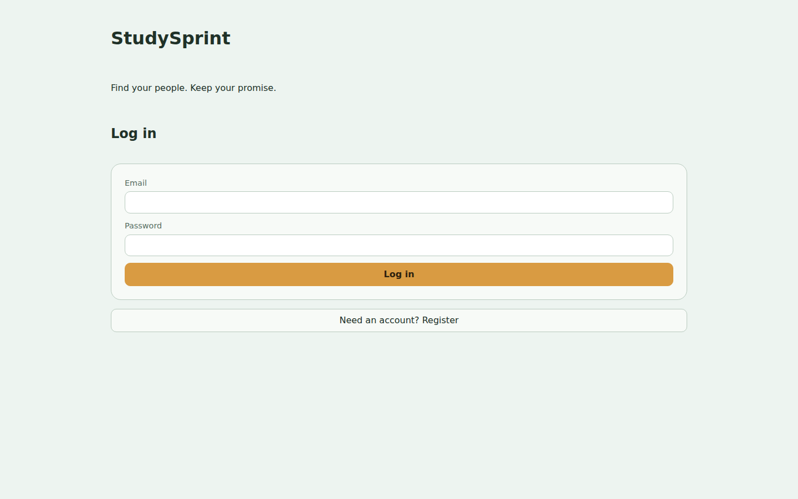
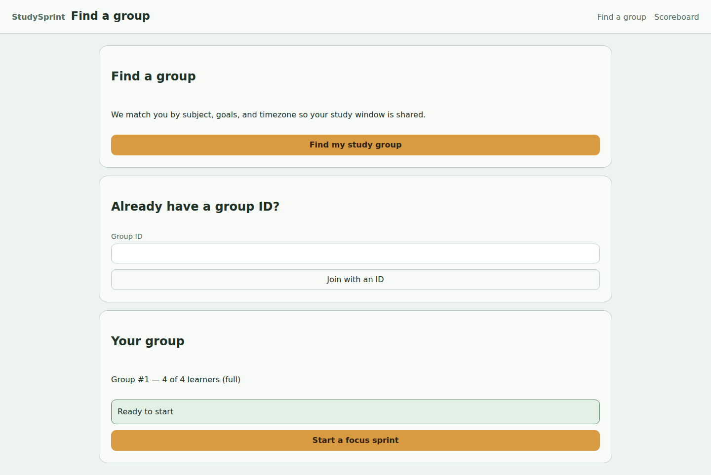
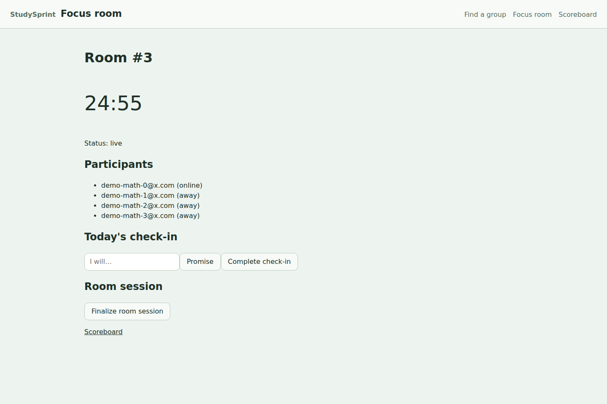
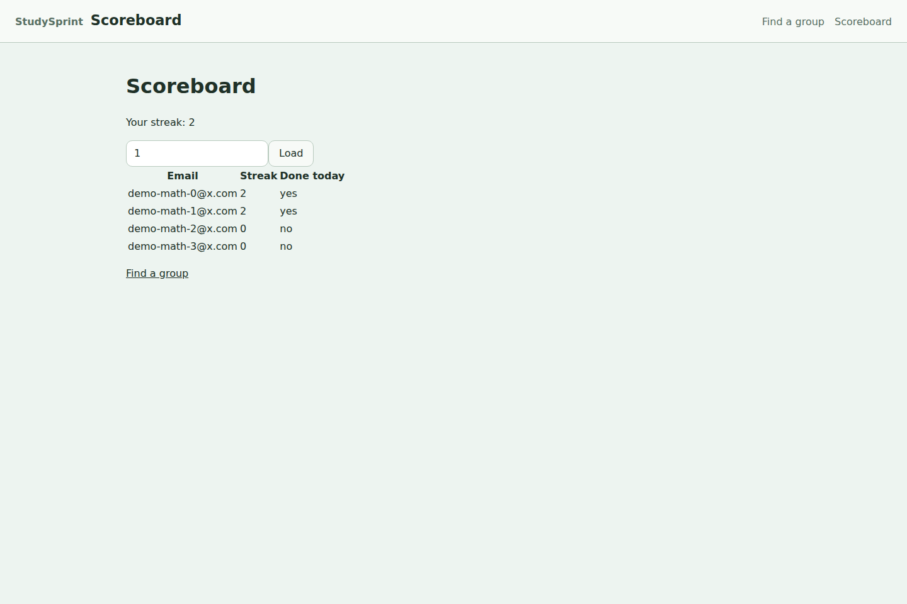

# StudySprint — Find your people. Keep your promise.

StudySprint matches students into small study groups and keeps them accountable
with shared focus rooms, daily promises, streaks, and a group scoreboard.
Think "Duolingo streaks meets Discord study rooms," built as a real,
full-stack product.



## What it does

- **Smart group matching** — "Find my study group" matches you by subject,
  goals, and timezone. A readiness badge tells you honestly whether the group
  can start or is still waiting for learners.
- **Live focus rooms** — a server-synchronized timer in the header, "Today's
  group commitments" front and center, and presence ("focused" / "away") for
  everyone in the room. Every connection outcome — reconnecting, finished,
  unavailable, lost — has an explicit, visible state.
- **Daily promises, not just check-ins** — "Make today's promise" → "I'm
  done." A completed promise stays completed; a duplicate is acknowledged,
  never re-asked.
- **Proof of consistency** — per-member streaks and "Complete today" /
  "Not complete" status text (never colour alone) on the group scoreboard.







Works on mobile too — the layout stacks to a single column with full-width
actions and no horizontal scrolling:


## Tech stack

| Layer    | Choices                                                        |
| -------- | -------------------------------------------------------------- |
| Frontend | React 18, TypeScript (strict), React Router 6, Vite 5, Vitest  |
| Backend  | FastAPI, SQLAlchemy 2, Alembic, Pydantic v2, PyJWT             |
| Data     | PostgreSQL 16                                                  |
| Realtime | WebSocket rooms with heartbeat, drift correction, and backoff  |

No component library, no CSS framework, no state-management library — the UI
is hand-built, and all branching logic lives in pure, dependency-free helper
modules that are unit-tested in Node.

## Run the demo (2 minutes, all local)

```bash
make dev    # db :5432, api :8000, web :5173 (first boot builds images)
make seed   # 12 users / 3 groups / 1 live session / check-ins (idempotent)
```

Open http://localhost:5173 and log in as `demo-math-0@x.com` / `secret123`.
Click **Find my study group** → **Start a focus sprint** → **Make today's
promise** → **I'm done** → **Scoreboard**. Full walkthrough, seeded accounts,
and edge cases to try are in [`docs/DEMO.md`](docs/DEMO.md).

## Checks

```bash
make test                         # backend pytest suite (isolated test DB)
cd frontend && npm test && npm run build
```

73 frontend tests green, `tsc --noEmit` clean, backend suite passing.
